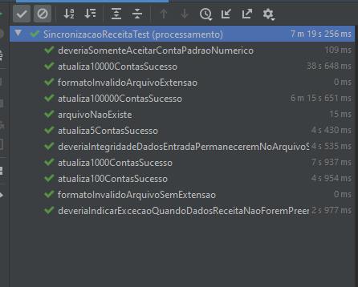

# SicronizacaoReceita

A versão do projeto Java utilizada nesse projeto foi a JDK 11.

Primeiramente realizar o build maven com o código: 

```maven
mvn clean install spring-boot:repackage
```

Depois executar o build com o comando:

```java
java -jar target/processamento-app-1.0.jar "caminhoArquivo"
```


O arquivo com os dados da Receita será atualizada dentro do projeto na pasta C:\Users\Matheus Herminio\Desktop\te\sincronizacao-receita\processamento-app\src\test\resources\sincronizacaoReceita\arquivo\saida
com o nome de arquivo igual ao de entrada.

Testes com 1000 threads:


Por: Matheus Herminio